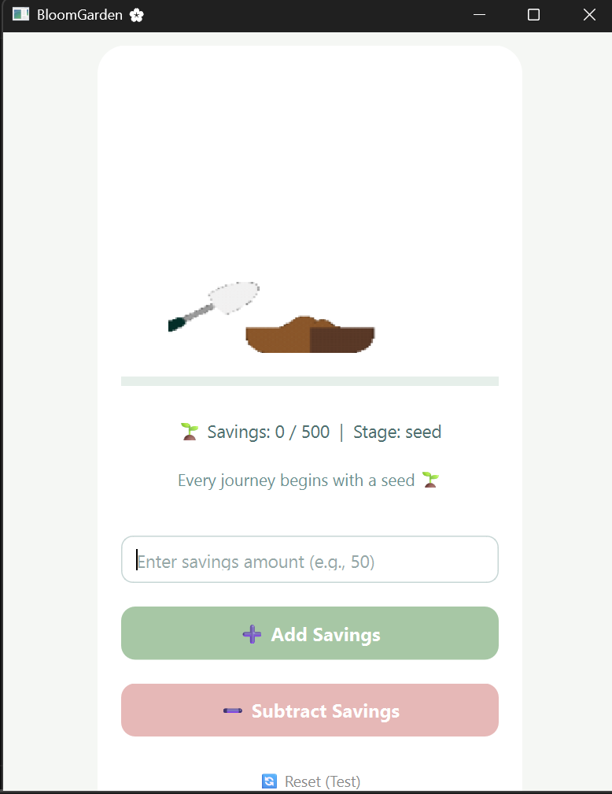
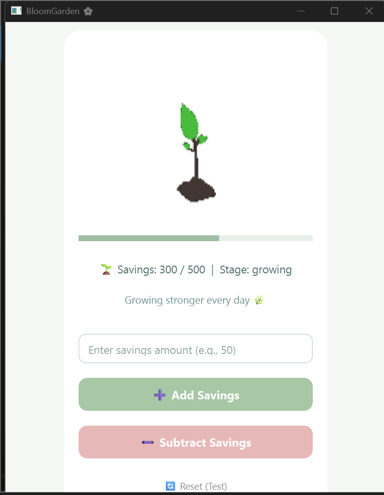
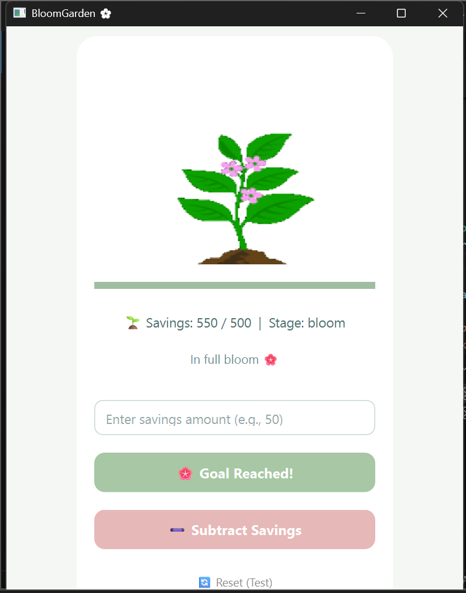

# 🌱 BloomGarden

A **gamified personal savings and progress-tracking application** built with Python.  
BloomGarden visualizes financial growth using plant life stages — from seed to full bloom.

---

## 🎯 Concept & Motivation

Saving money can feel abstract and unmotivating. BloomGarden turns progress into something **visible and rewarding**.

Each savings milestone grows a virtual plant:
- 🌱 Seed → 🌿 Growing → 🌸 Bloom

This makes progress tangible and engaging.

---

## 🛠 Tech Stack

- **Python**
- **SQLite** (persistent storage)
- **Local assets (GIFs)** for visual feedback

---

## 🧩 Application Structure

```
BloomGarden/
│
├── app.py # Main application logic
├── db/
│ └── bloomgarden.db # SQLite database
├── assets/
│ └── plant/
│ ├── seed.gif
│ ├── growing.gif
│ ├── bloom.gif
│ └── ...
```

---

## ⚙️ How It Works

- User enters a savings amount
- The value is stored persistently in SQLite
- Based on thresholds, the plant advances stages
- UI updates using animated GIFs
- Undo and reset actions allow safe experimentation

---

## 🖼 Screenshots

### 🌱 Seed Stage


### 🌿 Growing Stage


### 🌸 Full Bloom

---

## ▶️ Running the App

```bash
python app.py
```

## 🧠 What I Learned

Designing state-based application logic

Using SQLite for persistence

Structuring Python projects cleanly

Creating visual feedback loops for user motivation

Translating abstract goals into concrete UI states

## 🚀 Future Improvements

Multiple savings goals

Analytics & progress history

UI scaling and polish

Exportable reports
